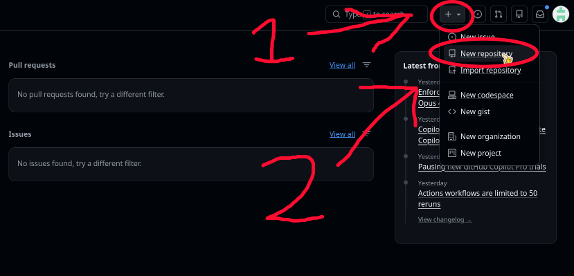
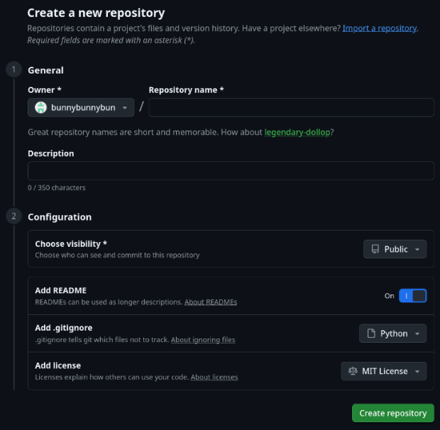
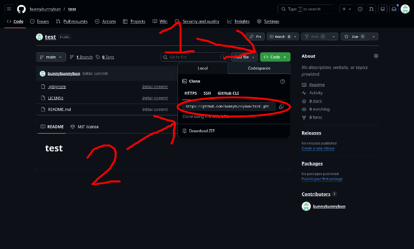

## This guide is a work in progress!

Make sure you have Hackatime setup before starting! Hackatime is what you use to keep track of how much time you spend coding, and we require you use it as part of how we verify you actually made something! Learn how to setup Hackatime [here](https://hackatime.hackclub.com/).

# Getting started with Python

This will teach you the very basics of Python! Python is a very popular programming language, and it's widely considered to be one of the best languages for beginners to learn how to code! Before we start with Python though, we need to setup Github.

## Setting up Git and Github

First of all, what _is_ Git, and why do we need it? To start, Git and Github are 2 different things. Git is a tool for managing your code projects. You store each of your projects in a repository, and whenever you make an update to your project, you can "commit" the changes to the repository. Git will keep a history of every change you have made, so that in case your update accidentaly broke something, you can easily undo your changes! Now, Git*hub* is a free service by Microsoft that allows you to host your Git repository -- which has all of your code -- in the cloud, which makes it easy to access your code from anywhere. It also makes sharing and collaborating on projects much easier, and serves as a backup in case your computer breaks and you lose all of your code (This has happened to me 😞... **back up your stuff!**) Git is used all the time by programmers, and using it is an essential skill to learn.

First up... Make an account! Go to github.com and sign up for an account (it's free, don't worry).

Now, create a new repository, like so:

y

Choose a name for your repository, and a short description. Set visibility to public and add README to on. For the "Add .gitignore" option, set it to Python. It's okay if you don't know what .gitignore is! It's not very important right now. And lastly, you can optionally set a license. You can use any license you want, or none at all, but do know that if you don't set a license, then nobody is allowed to use and improve upon your code in their own projects. I personally like to use an open source license, such as the [MIT License](https://choosealicense.com/licenses/mit/), which allows others to use my code in their projects if they wish.



Now copy the URL of your repository, you will need this soon!



So you have a repository on Github, but you also need to have Git installed on your computer. To install it, follow the instructions on the Git website [here](https://git-scm.com/install/). The installer might have a ton of settings to change. It should be fine to leave the settings on the default values.

After you've installed Git, you need to clone the repository that you made on Github onto your computer. This will let you do the coding in the local repository (the copy on your computer), and then synchronize your code onto the repository on Github (this action is referred to as "pushing" your code to Github) whenever you make a significant change to your code! To clone the repository, we will use the newly installed Git. On Mac and Linux, you use Git through the terminal. In your app launcher, search for "terminal" or "console", and launch it (you should'nt need to install anything extra right now since, Mac and Linux both come with a terminal app preinstalled). On Windows, instead of opening your regular terminal, you open Git's custom terminal app, called "Git Bash". From here on, the process should be the same on all operating systems.

Now that you have your terminal open, you may be thinking, "What is this? It's just text, what do I do?". The terminal is a little confusing at first, because everything is done through typing commands. The terminal is used for many different tasks, such as creating, moving, and editing files, monitoring system resources, and using programs like Git (which is what we will be doing now).

In your terminal, type `git clone <URL of Github repository>`. Obviously, replace `<URL of Github repository>` with the URL of your repository, which you copied earlier. Press enter, and Git will make a clone of the repository onto your machine.

**💡Tip: Having trouble pasting the URL? Try doing Control+Shift+V instead of Control+V.**

Open your file manager. You should see a new folder with the same name as the repository you created. Create a new file inside of that folder, and name it `main.py`. Open the file in a text editor (or a code editor/IDE if you wanna be fancy!), it's time to start coding!

## Coding time

Let's start with the classic "Hello world" program!

In the main.py file, write this:

```python
print("Hello world!")
```

This is one of the simplest scripts you can make. It simply prints out the sentence "Hello world!"

To run the program you just wrote, go back to the terminal, and type in this command: `cd <name of folder>`, but replace `<name of folder>` with the name of your project/repository. That will put you into the folder, just like when you open a folder in your file manager. Then run this command: `ls`. That tells you what files are inside of the folder you are in. You should see the file you made called `main.py`. Now run the command `python3 main.py`, that will run the program!

If it ran successfully, you should see "Hello world!" printed to the terminal. Congrats, you've made your first program! I know it's not super exciting, but I promise that you can do much cooler stuff with Python! Unfortunately, you can't really do the cooler stuff without learning these boring basics first. 😞

Try updating your code to this:

```python
name = input("What's your name?\n") # the \n tells it to start a new line
print("Hello " + name)
```

What's that do? The first line will ask for user input, and then set the value of the variable called `name` to whatever the user entered. Everything after the hashtag symbol (#) is considered a comment, which doesn't do anything. You can write anything there, it is just meant for leaving a note for yourself, to help you understand the code.

The second line prints out the text "Hello " plus the value of the `name` variable. Try running the new script by typing `python3 main.py` in the terminal again! It should ask you "What's your name". Just type something and press enter, and it will say hello to you.

I want the script to compliment me, but not other people, as a way to boost my ego. I can do this by using an if statement to check whether the name that the user entered is my name, and if it is, it will compliment them, and if not, it will say "Hello" like before.

Try it! Replace the print statement with this (but keep the first line):

```python
if name == "Carlisle": # Notice that here we used two equal signs (=), whereas in the first line we only used one. Whenever you are SETTING the value of a variable, you use one =, but when you are comparing the value, like we are in this line of code, you use two = signs.
    print("Hi, you are such an awesome person!")
else:
    print("Hello " + name)
```
